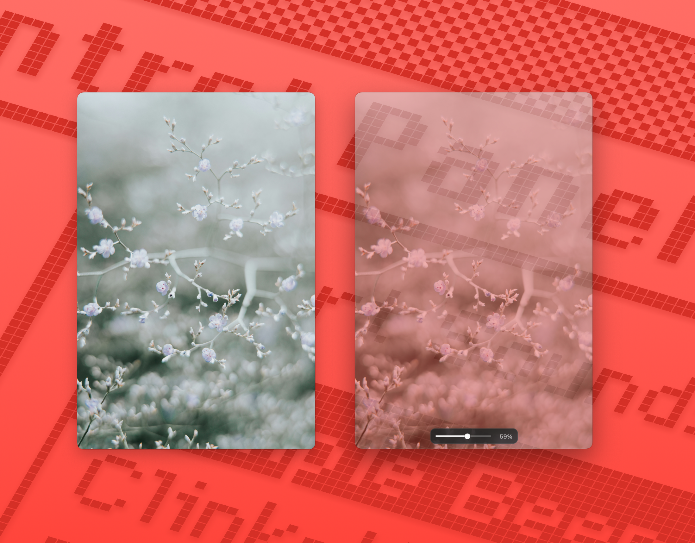

# Frameless

A tiny frameless image viewer for macOS, built with Electron.

It is meant for keeping a reference image floating beside your work without a title bar or other window chrome getting in the way.



## Features

- Frameless, transparent image window
- Drag and drop an image from Finder to open it
- Drag the image itself to move the window, including between displays
- Always-on-top mode
- Exact Fit mode keeps the window and image locked to the same shape while resizing
- Original Size mode shows the image at one screen pixel per image pixel
- Ctrl-scroll / pinch-style zooming
- Adjustable image opacity with a compact floating slider
- Right-click menu for the main viewing controls

## Controls

- `Cmd+0` — Exact Fit
- `Cmd+Shift+O` — Open the opacity control
- Right click — Open the viewer menu
- `Esc` — Close the opacity control first; when it is already closed, clear the current image

### Exact Fit

The window is resized to the image's aspect ratio. Resizing the window keeps the image and window locked together.

When zooming above the resting size, the window stays in place while the image grows inside it. Zooming below the resting size shrinks the window and image together.

### Original Size

Displays the image at its natural pixel dimensions. Images larger than the current display remain 1:1 and can be scrolled instead of being silently scaled down.

### Opacity

Choose `Opacity…` from the Options menu or the right-click menu, or press `Cmd+Shift+O`. The small floating slider changes the image opacity from 0% to 100% while keeping the control itself visible.

## Development

Install dependencies:

```sh
yarn
```

Run the app:

```sh
yarn start
```

Package the app locally:

```sh
yarn package
```

Build distributable artifacts:

```sh
yarn make
```

Electron Forge writes build output to `out/`.

## Notes

The custom drag implementation follows the system cursor by absolute screen position and includes handling for macOS multi-display window constraints, including displays arranged above one another.
